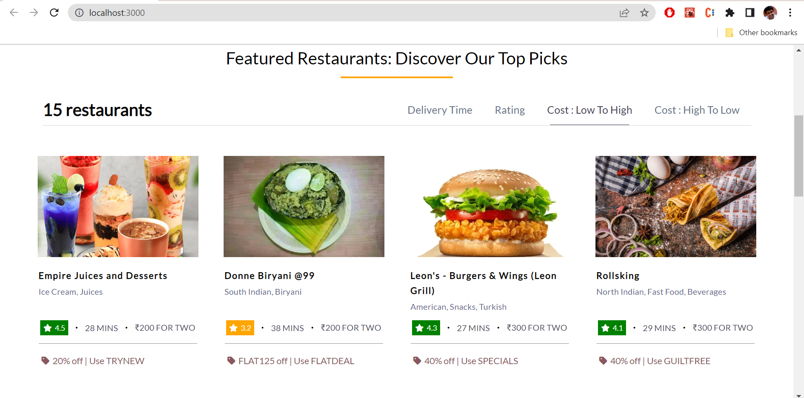
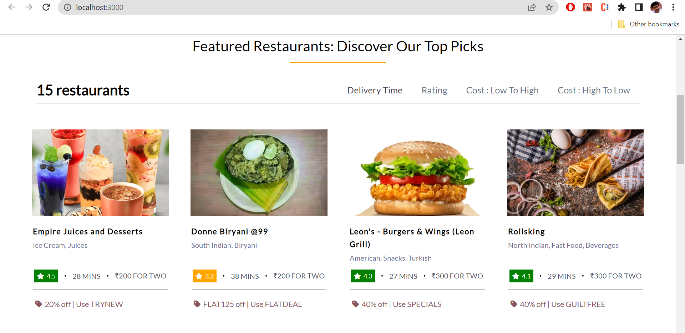
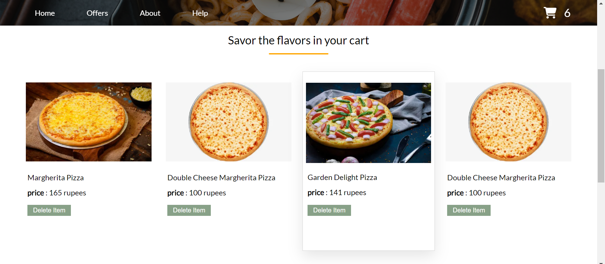
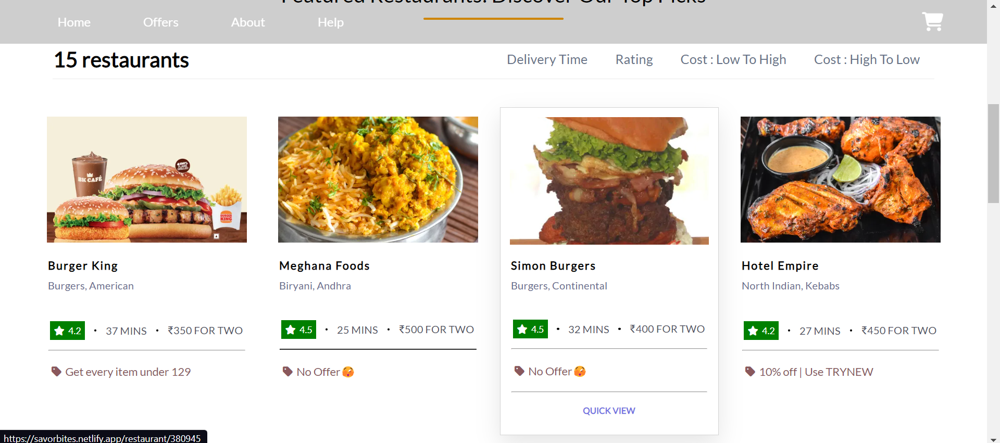
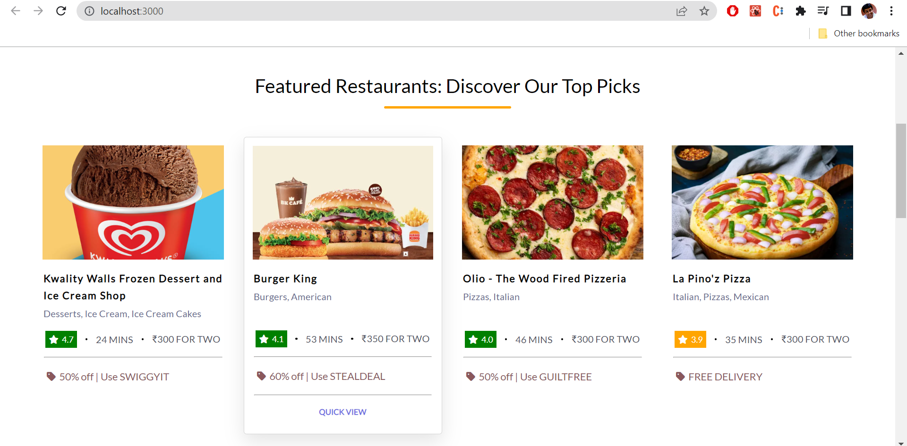
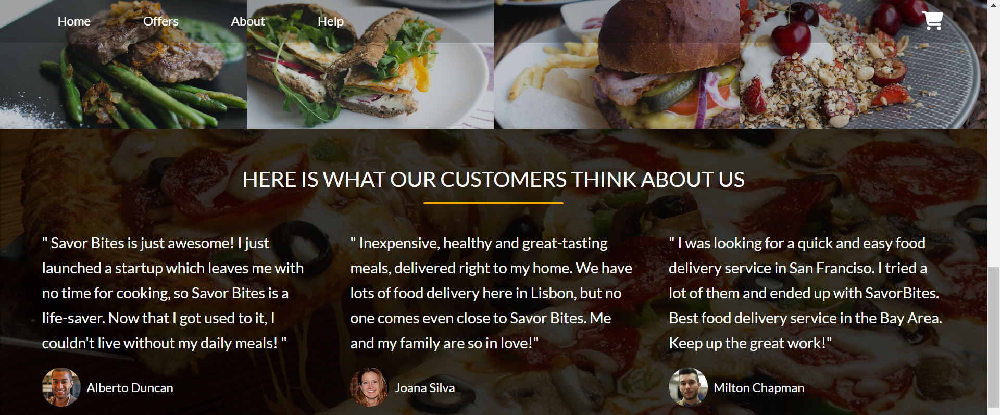
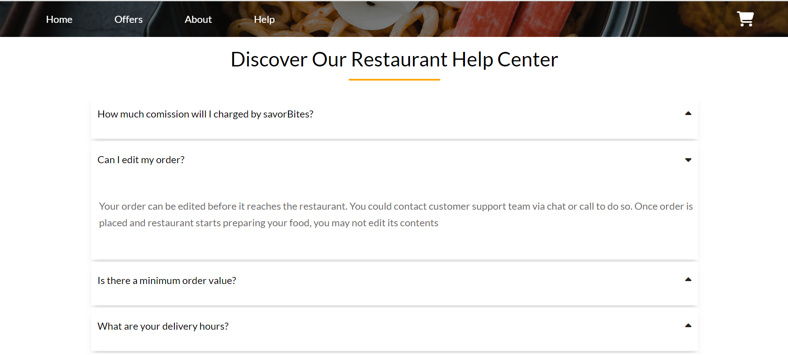

**Restuarant APP** : 🍔:
A Food Delivery app that is built with **HTML5, CSS3, React and Redux**  

> Note : Make sure you have the internet connection to render icons, images and other necessary data. <br><br>
> Since this project is using swiggy's public api, live link won't work because of <strong>CORS POLICY</strong>.

## Table of contents
- [General Info](#GeneralInfo)
- [Screenshots](#screenshots)
- [Preview](#preview)
- [Installation](#Installation)
- [Technologies](#Tech)
- [Features](#Features)

<a name = "GeneralInfo"> </a>
## 1. General Info 📝
The purpose of this project is to understand and implement the react concepts that i've learned to make the user interface look appealing besides having fun along the journey :smiley:.

<a name = "screenshots"> </a>
## 2. Screenshots 📸









<a name = "preview"> </a>
## 3. Preview 🎥
preview will be added shortly

<a name = "Installation"> </a>
## 4. Installation ❤️‍🔥

#### Clone the repo

```sh
$ git clone https://github.com/preetamvarun/Restaurant-App.git
```
### Navigate to project directory

```sh
$cd Restaurant-App/
```

### Install dependencies 
```sh
npm install
```

Start the app
```sh
npm run start
```

#### To create a build 
```sh
npm run build
```

<a name = "Tech"> </a>
## 5.Technologies Used 🧑‍💻:

<br>
<br>
<br>
<br>

<a name = "Features"> </a>
## 6. Features
User friendly 🔥 <br>
clean UI   ☘️ <br>
Responsive 💙 <br>
Shimmer UI 🔃 <br>
Real Time Data Fetching From Api 🌐 <br>
Centralized Data Store Using Redux 💾 <br>
Search Functionality 🔍 <br>
Filter Functionality ⌛ <br>
Cart Functionality 🛒
